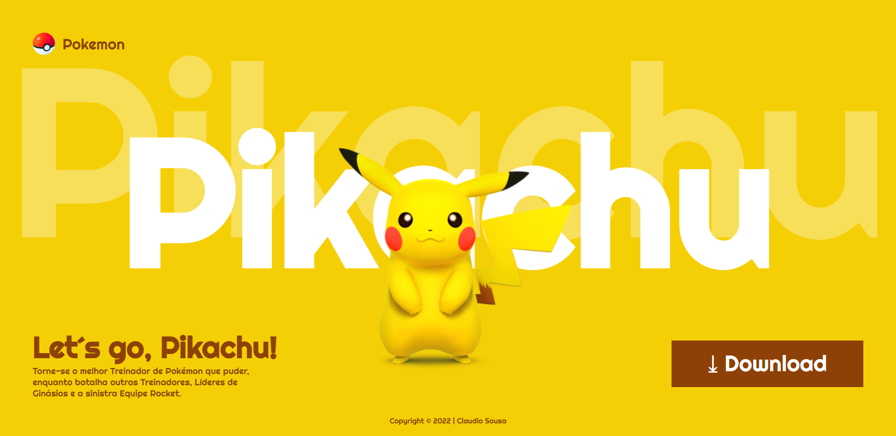

# landing-page-pikachu

[Clique aqui](https://claudiosousa44.github.io/landing-page-pikachu/) para acessar o projeto.

---
## Sobre
Site do tipo landing page para treino.
Objetivo deste projeto é colocar em prática os conhecimentos, sobre desenvolvimentos de sites, adquiridos no curso do SENAI de Jandira.

## Tecnologias utilizadas
- HTML5
- CSS
- Responsividade
- Markdown

---
## Autor 
- [Claudio Sousa](https://github.com/ClaudioSousa44)
